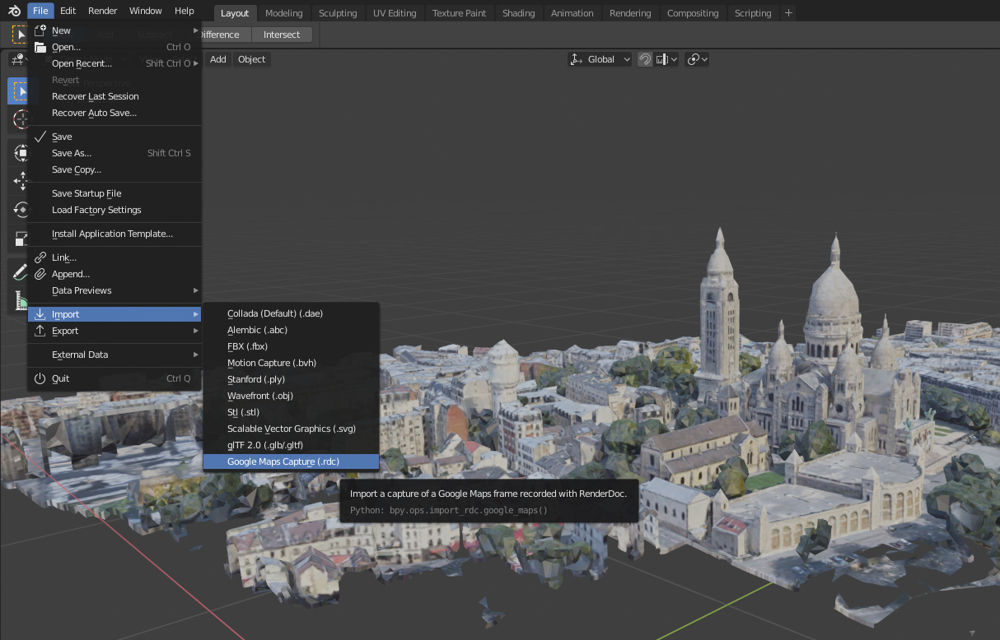
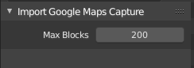

*If this helps you save time or money for your job, please condier supporting the work involved in here ;)* [](https://www.paypal.com/cgi-bin/webscr?cmd=_donations&business=DNEEF8GDX2EV6&currency_code=EUR&source=url)

**News** (from Feb 17, 2020) A new version is available that should make the whole process easier and work on more hardware. It now uses the last version of RenderDoc (1.6), the last version of Chrome (80) and the last version of Blender (2.82). This is quite a change and if you notice any regression (like it used to work and now it does not) please report!

Maps Models Importer
====================

*Maps Models Importer* is a set of tools for importint 3D models from wide maps in 3D content softwares.
This is a proof of concept containing only a Blender add-on for importing 3D models from Google Maps.

The `blender` directory contains the source code of the Blender add-on importing captures recorded with [RenderDoc](https://renderdoc.org/):



Installation
------------

Download a [release](https://github.com/eliemichel/MapsModelsImporter/releases) or make a zip of `blender/MapsModelsImporter/`. In Blender 2.82, go to `Edit > Preferences`, `Add-on`, `Install`, then browse to the zip file.

**/!\ Do not use the "Download as zip" button of GitHub, make sure you use a release zip instead.**

Install [RenderDoc](https://renderdoc.org/builds) **version 1.6**.

NB: If you are using an older release (v0.1.x and before), you must use the portable version of RenderDoc 1.2 or RenderDoc 1.1. This is no longer the case since v0.2.0 of this add-on.

Usage
-----

You can follow instruction from the walkthrough video: https://youtu.be/X6Q7dbtXVZQ Alternatively, check out the following steps:

  1. Start RenderDoc, and `File > Inject into process`;

  2. Start terminal (Win+R, "cmd") and run (adapt the second line to the location of your Chrome installation):

```
set RENDERDOC_HOOK_EGL=0
"C:\Program Files (x86)\Google\Chrome\Application\chrome.exe" --disable-gpu-sandbox --gpu-startup-dialog
```

  3. Do NOT press Ok on the dialog box yet;

  4. In RenderDoc, search for the chrome process and inject into it;

  5. Press OK in the chrome dialog;

  6. Go to Google Maps (not Google Earth!) in satellite view, and take a capture using `Print Screen` **while moving** in the viewport;

  7. In RenderDoc, save the capture as an rdc file

  8. In Blender, go to `File > Import > Google Maps Capture` an choose your capture file.

For step 2. you can create a link to Chrome rather than usig the cmd, and put as target (again, adapt the path to `chrome.exe` to your installation):

```
C:\Windows\System32\cmd.exe /c "SET RENDERDOC_HOOK_EGL=0 && START "" ^"C:\Program Files (x86)\Google\Chrome\Application\chrome.exe^" --disable-gpu-sandbox --gpu-startup-dialog"
```

Troubleshooting
---------------

Useful information can be found in the comment of the video, as well as on [the support thread on blenderartists](https://blenderartists.org/t/google-maps-models-importer/1153561).

### Linux

Unfortunately, the *inject into process* functionality of RenderDoc is not supported on linux. You can still import existing captures on linux, though.

### Missing blocks



By default, the addon limits to 200 blocks, but if you feel ready to let your Blender hang for a moment, you can increase it.

### I don't want to uninstall Google Chrome...

Since version v0.2.0 of this add-on, it is no longer needed to install an old version of Chrome.

With older versions (depreciated) of this add-on, you have to use a specific version of Chrome. Check this trick out to install it alongside your current version: https://github.com/eliemichel/MapsModelsImporter/issues/15

### There is no option for 3D in Google Maps

Try appending `?force=webgl` at the end of the google maps URL. Also, check that you enabled the Globe mode (an extra button on the right-hand side once you are in satellite mode).

### API: OpenGL (Not Presenting)

This was a common issue with versions of this add-on prior to v0.2.0. Update to the latest version of this add-on, then make sure you remove the `--use-angle=gl` option from the chrome shortcut.

### Chrome is showing a warning about an unsupported feature

If this is about the `--disable-gpu-sandbox` flag, it is just a warning, it should not be a problem.

### Chrome window is all plain black

Try to set and unset the fullscreen mode using F11.

### How to increase the level of detail?

If you want better quality captures, you should know that Google Maps loads LoDs (Levels of Details) in relation with the window size of your web browser. There is several way to increase it:

 - You can increase your screen resolution. Also note that nvidia allows now to increase the rendering resolution of your screen to 4k even with a simple full HD screen.
 - You can also use the rendering size percentage in Google Chrome. Most browsers do offer the option to zoom in or out the web pages (typically using Ctrl+Mouse Wheel) to adapt them to your screen resolution. By setting the zoom at e.g. 25% in Google Chrome, you increase the level of detail loaded by Google Maps.

But while doing so you also increase dramatically the number of block. Be aware of the fact that by default the MapsModelsImporter add-on limits to 200 blocks to prevent from freezing for too long. You can change this number on import.

Disclaimer
----------

This is a proof of concept showcasing how the 3D render process of Google Maps can be inspected. This is intended for educational purpose only. For a more in-depth analysis, see [Importing Actual 3D Models From Google Maps](https://blog.exppad.com/article/importing-actual-3d-models-from-google-maps).

Do not use this for any commercial nor redistribution purpose. Actually, the use of such tool might be allowed for private read-only use, as this is what happens when browsing Google Maps, but not beyond. I do not take responsibility for any use of this tool.


Help Wanted
-----------

This repository does not provide the required RenderDoc binaries for linux nor for OSX. If you have such a system, build RenderDoc against Python 3.7.4 (the minor version matters) to be compatible with the version of Blender's Python distribution.

Other links
-----------

To import map data in Blender, this open source addon is very handy: [domlysz/BlenderGIS](https://github.com/domlysz/BlenderGIS)

Here is another attempt at reverse-engineering Google data: [retroplasma/earth-reverse-engineering](https://github.com/retroplasma/earth-reverse-engineering)
